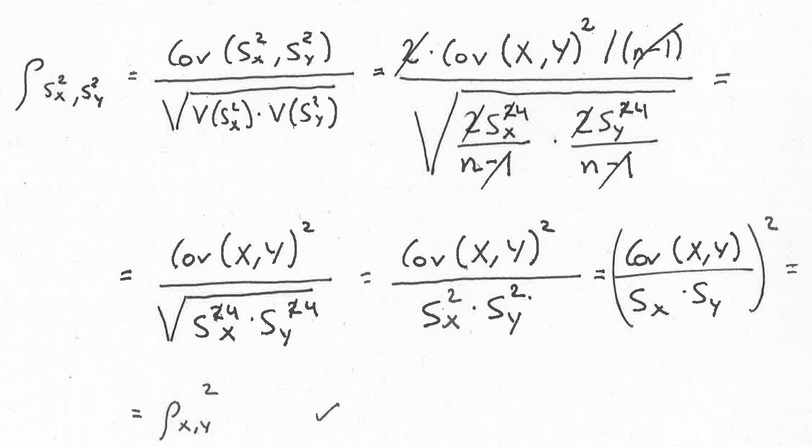

```{r setup, include=FALSE}
library(MASS)
knitr::opts_chunk$set(echo = TRUE)
```

## Simulation

A single simulation with fixed parameters was carried out to check the theoretical result:

$\rho_{S^2_X,S^2_Y} \approx \rho_{X,Y}^2$



### Parameters to generate the data

```{r parameters}
## Parameters
mu <- c(0,0)                                 # E(X) and E(Y) --> Irrelevant

Vx <- 3                                      # V(X)
Vy <- .2                                     # V(Y)
covxy <- 0.7                                 # Cov(X,Y)
Sigma <- matrix(c(Vx,covxy,covxy,Vy),nrow=2) # Variance covariance matrix

nsim <- 10000
n <- 200
```

- Distribution: *Bivariate normal*
- Expected value of X (*mu[1]*): `r mu[1]` (Irrelevant)
- Expected value of Y (*mu[2]*): `r mu[2]` (Irrelevant)
- Variance of X (*Vx*): `r Vx`
- Variance of Y (*Vy*): `r Vy`
- Covariance of (X,Y) (*covxy*): `r covxy`   
- Number of simulations (*nsim*): `r nsim`
- Sample size (*n*): `r n`

### Result

 
```{r simulation}
# To store information
S2_x <- S2_y <- c()

# Generate nsim paired samples
set.seed(12345)
for (k in 1:nsim){
  mostra <- mvrnorm(n = 100, mu=mu, Sigma=Sigma)
  S2_x[k] <- var(mostra[,1])
  S2_y[k] <- var(mostra[,2])
}

# Simulated result
res_sim <- cor(S2_x,S2_y)

# Expected result
res_theo <- covxy^2/(Vx*Vy)

```

The simulated result for $\rho_{S^2_X,S^2_Y}$ is **`r formatC(res_sim,digits=3,format='f')`** and using the theoretical result using the abovementioned formula is **`r formatC(res_theo,digits=3,format='f')`**.

### Conclusion

For other parameters within the bivariate Normal distribution, the result is quite good.

## References 

1. Muirhead, R. J. (1982). Aspects of Multivariate Statistical Theory. New York, NY: John Wiley & Sons.

2. https://www.jepusto.com/distribution-of-sample-variances/